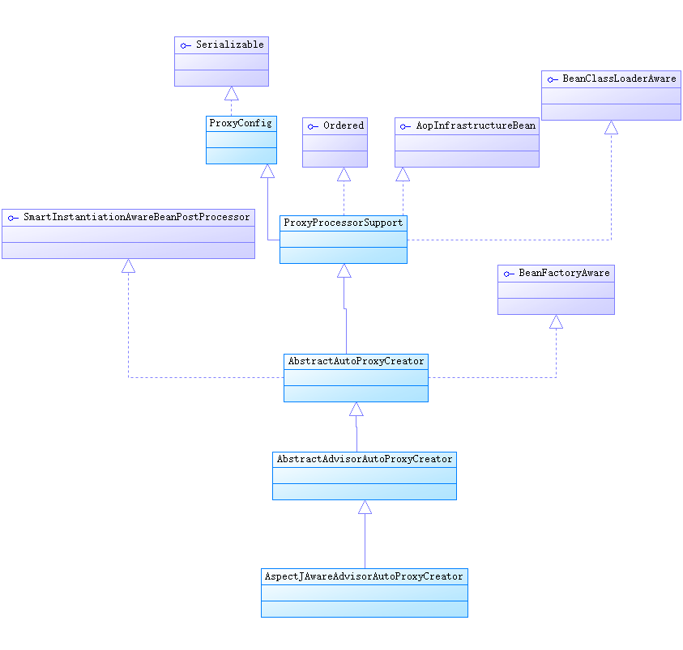
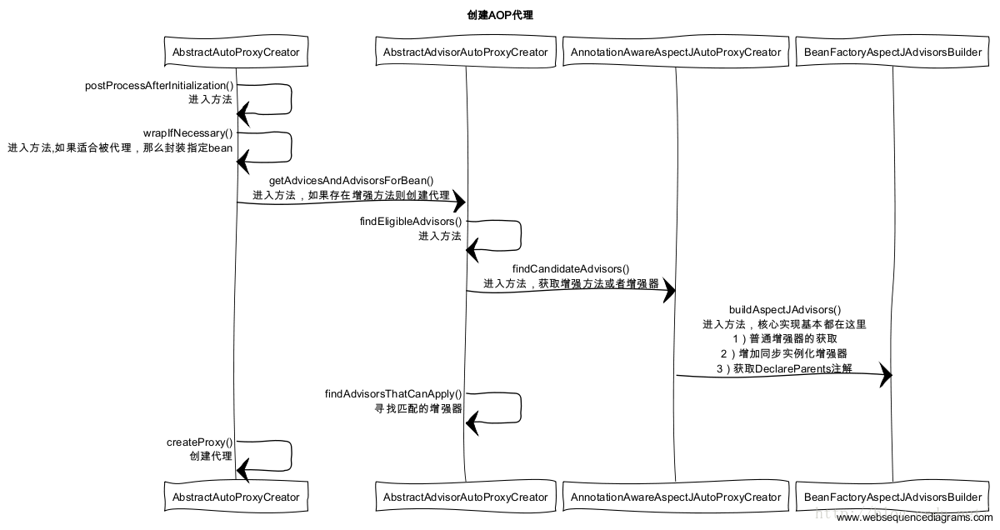

## AOP Bean处理

### 源码分析

Spring AOP代理对象也是通过Spring容器管理的，都是通过getBean()获取bean的，Spring在加载Bean定义时就对AOP进行了特殊处理。
这里就不细说Spring bean创建过程了,直接跳到bean解析-DefaultBeanDefinitionDocumentReader的parseBeanDefinitions()

```java
//DefaultBeanDefinitionDocumentReader.java
	protected void parseBeanDefinitions(Element root, BeanDefinitionParserDelegate delegate) {
		if (delegate.isDefaultNamespace(root)) {//namespace是否空或http://www.springframework.org/schema/beans
			NodeList nl = root.getChildNodes();
			for (int i = 0; i < nl.getLength(); i++) {//遍历子节点
				Node node = nl.item(i);
				if (node instanceof Element) {
					Element ele = (Element) node;
					if (delegate.isDefaultNamespace(ele)) {
						//解析默认schema定义的<import />、<alias />、<bean />、<beans />节点
						parseDefaultElement(ele, delegate);
					}
					else {
						//解析 <mvc />、<task />、<context />、<aop />
						delegate.parseCustomElement(ele);
					}
				}
			}
		}
		else {//解析 <mvc />、<task />、<context />、<aop />
			delegate.parseCustomElement(root);
		}
	}
```

由上可知 spring对配置文件中默认namespace下的&lt;bean>等和其它元素如&lt;aop>等采用不同的解析模式，这里我们只围观解析&lt;aop>的parseCustomElement()方法，源码如下：

```java
//BeanDefinitionParserDelegate.java
	public BeanDefinition parseCustomElement(Element ele) {
		return parseCustomElement(ele, null);
	}

	public BeanDefinition parseCustomElement(Element ele, BeanDefinition containingBd) {
		String namespaceUri = getNamespaceURI(ele);//获取元素的namespace
		//1.通过namespace得到Namespace处理器
		NamespaceHandler handler = this.readerContext.getNamespaceHandlerResolver().resolve(namespaceUri);
		if (handler == null) {
			error("Unable to locate Spring NamespaceHandler for XML schema namespace [" + namespaceUri + "]", ele);
			return null;
		}
		//2.重要方法，解析element为BeanDefinition
		return handler.parse(ele, new ParserContext(this.readerContext, this, containingBd));
	}
```
解析过程是首先通过namespace得到一个NameSpaceHandler实例，然后由该NameSpaceHandler实例的parse方法解析elment为BeanDefinition。
aop的NameSpaceHandler是org.springframework.aop.config.AopNamespaceHandler，该类继承NamespaceHandlerSupport，它在init()方法中声明了AOP所使用几个Parser，如下：

```java
public class AopNamespaceHandler extends NamespaceHandlerSupport {

	@Override
	public void init() {
		// In 2.0 XSD as well as in 2.1 XSD.
		registerBeanDefinitionParser("config", new ConfigBeanDefinitionParser());
		registerBeanDefinitionParser("aspectj-autoproxy", new AspectJAutoProxyBeanDefinitionParser());
		registerBeanDefinitionDecorator("scoped-proxy", new ScopedProxyBeanDefinitionDecorator());

		// Only in 2.0 XSD: moved to context namespace as of 2.1
		registerBeanDefinitionParser("spring-configured", new SpringConfiguredBeanDefinitionParser());
	}

}
```
AopNamespaceHandler直接继承沿用父类NamespaceHandlerSupport的parse()方法，源码如下：

```java
public abstract class NamespaceHandlerSupport implements NamespaceHandler {
    //其它方法略
    @Override
	public BeanDefinition parse(Element element, ParserContext parserContext) {
        //findParserForElement()方法通过element获取具体的Parser
		return findParserForElement(element, parserContext).parse(element, parserContext);
	}
}
```
#### 解析&lt;aop:config>
对于AOP配置，首先获取的节点是&lt;aop:config>,该节点通过ConfigBeanDefinitionParserd的parse()方法解析，即上面的findParserForElement()返回该节点通过ConfigBeanDefinitionParserd实例。

解析过程是：
1. 默认注册一个AspectJAwareAdvisorAutoProxyCreator BeanDefiniton
2. 解析proxy-target-class或expose-proxy属性，若为true则设置暴露最终代理
3. 获取&lt;aop:config>的子节点，遍历子节点并解析
4. 最终返回null
解析方法查看ConfigBeanDefinitionParser的parse方法，下面又贴代码了。
```java
//ConfigBeanDefinitionParser.java
	public BeanDefinition parse(Element element, ParserContext parserContext) {
		CompositeComponentDefinition compositeDef =
				new CompositeComponentDefinition(element.getTagName(), parserContext.extractSource(element));
		parserContext.pushContainingComponent(compositeDef);

		//默认注册一个AspectJAwareAdvisorAutoProxyCreator BeanDefiniton
		//若proxy-target-class或expose-proxy属性设置为true,则设置暴露最终代理
		configureAutoProxyCreator(parserContext, element);

		List<Element> childElts = DomUtils.getChildElements(element);
		for (Element elt: childElts) {
			String localName = parserContext.getDelegate().getLocalName(elt);
			if (POINTCUT.equals(localName)) {//解析<aop:pointcut>子元素
				parsePointcut(elt, parserContext);
			}
			else if (ADVISOR.equals(localName)) {//解析advisor子元素
				parseAdvisor(elt, parserContext);
			}
			else if (ASPECT.equals(localName)) {//解析<aop:apsect>子元素
				parseAspect(elt, parserContext);
			}
		}

		parserContext.popAndRegisterContainingComponent();
		return null;
	}
```
#### 解析&lt;aop:apsect>
解析&lt;aop:apsect>元素【重要】，过程如下：
1. 获取所有&lt;aop:declare-parents>子元素，遍历解析为beanClass=DeclareParentsAdvisor.Class的BeanDefinition并添加；
2. 获取所有&lt;aop:before>、&lt;aop:after>、&lt;aop:after-returning>等advice子元素，遍历为BeanDefinition并添加；
3. 解析&lt;aop:pointcut>子元素为beanClass=AspectJExpressionPointcut的BeanDefinition并添加

```java
//ConfigBeanDefinitionParser.java
	private void parseAspect(Element aspectElement, ParserContext parserContext) {
		String aspectId = aspectElement.getAttribute(ID);
		String aspectName = aspectElement.getAttribute(REF);

		try {
			this.parseState.push(new AspectEntry(aspectId, aspectName));
			List<BeanDefinition> beanDefinitions = new ArrayList<BeanDefinition>();
			List<BeanReference> beanReferences = new ArrayList<BeanReference>();

			//获取<aop:declare-parents>子元素，解析
			List<Element> declareParents = DomUtils.getChildElementsByTagName(aspectElement, DECLARE_PARENTS);
			for (int i = METHOD_INDEX; i < declareParents.size(); i++) {
				Element declareParentsElement = declareParents.get(i);
				beanDefinitions.add(parseDeclareParents(declareParentsElement, parserContext));
			}

			// We have to parse "advice" and all the advice kinds in one loop, to get the
			// ordering semantics right.
			NodeList nodeList = aspectElement.getChildNodes();//获取子节点
			boolean adviceFoundAlready = false;
			for (int i = 0; i < nodeList.getLength(); i++) {
				Node node = nodeList.item(i);
				if (isAdviceNode(node, parserContext)) {//判断是否为<aop:around>，<aop:after>等advice子元素
					if (!adviceFoundAlready) {
						adviceFoundAlready = true;
						if (!StringUtils.hasText(aspectName)) {
							parserContext.getReaderContext().error(
									"<aspect> tag needs aspect bean reference via 'ref' attribute when declaring advices.",
									aspectElement, this.parseState.snapshot());
							return;
						}
						beanReferences.add(new RuntimeBeanReference(aspectName));
					}
					//解析advice子元素
					//即处理<aop:before>、<aop:after>、<aop:after-returning>、<aop:after-throwing method="">、<aop:around method="">
					AbstractBeanDefinition advisorDefinition = parseAdvice(
							aspectName, i, aspectElement, (Element) node, parserContext, beanDefinitions, beanReferences);
					beanDefinitions.add(advisorDefinition);
				}
			}

			AspectComponentDefinition aspectComponentDefinition = createAspectComponentDefinition(
					aspectElement, aspectId, beanDefinitions, beanReferences, parserContext);
			parserContext.pushContainingComponent(aspectComponentDefinition);

			//获取<aop:pointcut>子元素，遍历解析
			List<Element> pointcuts = DomUtils.getChildElementsByTagName(aspectElement, POINTCUT);
			for (Element pointcutElement : pointcuts) {
				parsePointcut(pointcutElement, parserContext);
			}

			parserContext.popAndRegisterContainingComponent();
		}
		finally {
			this.parseState.pop();
		}
	}
```
#### 解析advice子元素
parseAdvice()方法用来解析&lt;aop:aspect>的&lt;aop:before>等子元素，重要方法是createAdviceDefinition()。

```java
//ConfigBeanDefinitionParser.java
	private AbstractBeanDefinition parseAdvice(
			String aspectName, int order, Element aspectElement, Element adviceElement, ParserContext parserContext,
			List<BeanDefinition> beanDefinitions, List<BeanReference> beanReferences) {

		try {
			this.parseState.push(new AdviceEntry(parserContext.getDelegate().getLocalName(adviceElement)));

			// create the method factory bean
			RootBeanDefinition methodDefinition = new RootBeanDefinition(MethodLocatingFactoryBean.class);
			methodDefinition.getPropertyValues().add("targetBeanName", aspectName);
			methodDefinition.getPropertyValues().add("methodName", adviceElement.getAttribute("method"));
			methodDefinition.setSynthetic(true);

			// create instance factory definition
			RootBeanDefinition aspectFactoryDef =
					new RootBeanDefinition(SimpleBeanFactoryAwareAspectInstanceFactory.class);
			aspectFactoryDef.getPropertyValues().add("aspectBeanName", aspectName);
			aspectFactoryDef.setSynthetic(true);

			// register the pointcut
			//重要方法
			AbstractBeanDefinition adviceDef = createAdviceDefinition(
					adviceElement, parserContext, aspectName, order, methodDefinition, aspectFactoryDef,
					beanDefinitions, beanReferences);

			//将adviceDef包装成RootBeanDefinition
			// configure the advisor
			RootBeanDefinition advisorDefinition = new RootBeanDefinition(AspectJPointcutAdvisor.class);
			advisorDefinition.setSource(parserContext.extractSource(adviceElement));
			advisorDefinition.getConstructorArgumentValues().addGenericArgumentValue(adviceDef);
			//查看是否有order属性，该属性用来控制切入方法优先级
			if (aspectElement.hasAttribute(ORDER_PROPERTY)) {
				advisorDefinition.getPropertyValues().add(
						ORDER_PROPERTY, aspectElement.getAttribute(ORDER_PROPERTY));
			}

			// register the final advisor
			//注册该BeanDeifination到注册表中
			parserContext.getReaderContext().registerWithGeneratedName(advisorDefinition);

			return advisorDefinition;
		}
		finally {
			this.parseState.pop();
		}
	}
	private AbstractBeanDefinition createAdviceDefinition(
			Element adviceElement, ParserContext parserContext, String aspectName, int order,
			RootBeanDefinition methodDef, RootBeanDefinition aspectFactoryDef,
			List<BeanDefinition> beanDefinitions, List<BeanReference> beanReferences) {
		//getAdviceClass()获取不同before,after等对应的Advice的实现类
		RootBeanDefinition adviceDefinition = new RootBeanDefinition(getAdviceClass(adviceElement, parserContext));
		adviceDefinition.setSource(parserContext.extractSource(adviceElement));

		adviceDefinition.getPropertyValues().add(ASPECT_NAME_PROPERTY, aspectName);
		adviceDefinition.getPropertyValues().add(DECLARATION_ORDER_PROPERTY, order);

		if (adviceElement.hasAttribute(RETURNING)) {
			adviceDefinition.getPropertyValues().add(
					RETURNING_PROPERTY, adviceElement.getAttribute(RETURNING));
		}
		if (adviceElement.hasAttribute(THROWING)) {
			adviceDefinition.getPropertyValues().add(
					THROWING_PROPERTY, adviceElement.getAttribute(THROWING));
		}
		if (adviceElement.hasAttribute(ARG_NAMES)) {
			adviceDefinition.getPropertyValues().add(
					ARG_NAMES_PROPERTY, adviceElement.getAttribute(ARG_NAMES));
		}

		ConstructorArgumentValues cav = adviceDefinition.getConstructorArgumentValues();
		cav.addIndexedArgumentValue(METHOD_INDEX, methodDef);

		//parsePointcutProperty()解析advice元素包含的pointcut
		//若含pointcut属性则创建该pointcut对应的BeanDefinition并返回,若含pointcut-ref则返回属性值
		Object pointcut = parsePointcutProperty(adviceElement, parserContext);
		if (pointcut instanceof BeanDefinition) {
			cav.addIndexedArgumentValue(POINTCUT_INDEX, pointcut);
			beanDefinitions.add((BeanDefinition) pointcut);
		}
		else if (pointcut instanceof String) {
			RuntimeBeanReference pointcutRef = new RuntimeBeanReference((String) pointcut);
			cav.addIndexedArgumentValue(POINTCUT_INDEX, pointcutRef);
			beanReferences.add(pointcutRef);
		}

		cav.addIndexedArgumentValue(ASPECT_INSTANCE_FACTORY_INDEX, aspectFactoryDef);

		return adviceDefinition;
	}
    //获取元素对应的Advice的实现类
	private Class<?> getAdviceClass(Element adviceElement, ParserContext parserContext) {
		String elementName = parserContext.getDelegate().getLocalName(adviceElement);
		if (BEFORE.equals(elementName)) {
			return AspectJMethodBeforeAdvice.class;
		}
		else if (AFTER.equals(elementName)) {
			return AspectJAfterAdvice.class;
		}
		else if (AFTER_RETURNING_ELEMENT.equals(elementName)) {
			return AspectJAfterReturningAdvice.class;
		}
		else if (AFTER_THROWING_ELEMENT.equals(elementName)) {
			return AspectJAfterThrowingAdvice.class;
		}
		else if (AROUND.equals(elementName)) {
			return AspectJAroundAdvice.class;
		}
		else {
			throw new IllegalArgumentException("Unknown advice kind [" + elementName + "].");
		}
	}
```
#### 解析&lt;aop:pointcut>元素
解析&lt;aop:pointcut>元素，还算比较简单的。解析逻辑在ConfigBeanDefinitionParser的parsePointcut方法中,该方法中创建BeanDefinition的重要方法是createPointcutDefinition(),我们就直接看该方法。

```java
	protected AbstractBeanDefinition createPointcutDefinition(String expression) {
		RootBeanDefinition beanDefinition = new RootBeanDefinition(AspectJExpressionPointcut.class);
		beanDefinition.setScope(BeanDefinition.SCOPE_PROTOTYPE);
		beanDefinition.setSynthetic(true);
		beanDefinition.getPropertyValues().add(EXPRESSION, expression);
		return beanDefinition;
	}
```
由上可以看出&lt;aop:pointcut>元素解析出来的BeanDefinition是prototype的。

### 总结

解析&lt;aop:config>元素及其子元素为BeanDefinition,并注册到BeanDefinition注册表，如下为元素对应的Class:
&lt;aop:declare-parents> ==> DeclareParentsAdvisor.Class
&lt;aop:pointcut> ==> AspectJExpressionPointcut.class
&lt;aop:before> ==> AspectJMethodBeforeAdvice.class
&lt;aop:around> ==> AspectJAroundAdvice.class
&lt;aop:after> ==> AspectJAfterAdvice.class
&lt;aop:after-returning>  ==> AspectJAfterReturningAdvice.class
&lt;aop:after-throwing>  ==> AspectJAfterThrowingAdvice.class

## Proxy Bean创建

接下来到Proxy Bean的创建了，回顾一下Bean的创建过程,还是将Bean实例化代码重新粘贴,代码中并未实际看到有关AOP代理类的生成过程。

```java
//AbstractAutowireCapableBeanFactory.initializeBean()方法
	protected Object initializeBean(final String beanName, final Object bean, RootBeanDefinition mbd) {
		if (System.getSecurityManager() != null) {
			AccessController.doPrivileged(new PrivilegedAction<Object>() {
				@Override
				public Object run() {
					invokeAwareMethods(beanName, bean);
					return null;
				}
			}, getAccessControlContext());
		}
		else {
			 //若bean 实现了 BeanNameAware、BeanClassLoaderAware 或 BeanFactoryAware 接口，回调
			invokeAwareMethods(beanName, bean);
		}

		Object wrappedBean = bean;
		if (mbd == null || !mbd.isSynthetic()) {
			//BeanPostProcessor 的 postProcessBeforeInitialization 回调
			wrappedBean = applyBeanPostProcessorsBeforeInitialization(wrappedBean, beanName);
		}

		try {
			//首先若 bean 实现了 InitializingBean 接口，调用 afterPropertiesSet()方法
			//再者若 bean 中定义的 init-method，则调用该初始化方法
            invokeInitMethods(beanName, wrappedBean, mbd);
		}catch (Throwable ex) {
			throw new BeanCreationException(
					(mbd != null ? mbd.getResourceDescription() : null),
					beanName, "Invocation of init method failed", ex);
		}

		if (mbd == null || !mbd.isSynthetic()) {
			// BeanPostProcessor 的 postProcessAfterInitialization 回调
			wrappedBean = applyBeanPostProcessorsAfterInitialization(wrappedBean, beanName);
		}
		return wrappedBean;
	}
```
前面在讲&lt;aop:config>的解析时，ConfigBeanDefinitionParser.parse()中会默认注册一个AspectJAwareAdvisorAutoProxyCreator，这里先说明一下AOP的核心类-AspectJAwareAdvisorAutoProxyCreator,其类结构图如下。

从类图可以看出AspectJAwareAdvisorAutoProxyCreator是BeanPostProcessor的实现类，Bean在初始化时会回调BeanPostProcessor的两个方法，所以AOP Bean初始化时则回调AspectJAwareAdvisorAutoProxyCreator对BeanPostProcessor接口中回调函数的实现。

AspectJAwareAdvisorAutoProxyCreator的postProcessBeforeInitialization方法与postProcessAfterInitialization方法实现在父类AbstractAutoProxyCreator中，其中postProcessBeforeInitialization方法是个空方法，所以我们就只要看postProcessAfterInitialization方法。

```java
//AbstractAutoProxyCreator.java
	@Override
	public Object postProcessAfterInitialization(Object bean, String beanName) throws BeansException {
		if (bean != null) {
			Object cacheKey = getCacheKey(bean.getClass(), beanName);
			if (!this.earlyProxyReferences.contains(cacheKey)) {
				return wrapIfNecessary(bean, beanName, cacheKey);//重要方法
			}
		}
		return bean;
	}
	protected Object wrapIfNecessary(Object bean, String beanName, Object cacheKey) {
		//不需要生成Proxy的场景
		if (beanName != null && this.targetSourcedBeans.contains(beanName)) {
			return bean;
		}
		if (Boolean.FALSE.equals(this.advisedBeans.get(cacheKey))) {
			return bean;
		}
		if (isInfrastructureClass(bean.getClass()) || shouldSkip(bean.getClass(), beanName)) {
			this.advisedBeans.put(cacheKey, Boolean.FALSE);
			return bean;
		}

		//getAdvicesAndAdvisorsForBean()为bean找到对应的advice,没有advice则不用生成proxy
		//将该bean是否要生成Proxy的true/false结果写到map,便于下次快速判断
		// Create proxy if we have advice.
		Object[] specificInterceptors = getAdvicesAndAdvisorsForBean(bean.getClass(), beanName, null);
		
		//判断为Proxy类时，则实例化该Proxy类
		if (specificInterceptors != DO_NOT_PROXY) {
			this.advisedBeans.put(cacheKey, Boolean.TRUE);
			//生成代理对象【重要方法】
			Object proxy = createProxy(
					bean.getClass(), beanName, specificInterceptors, new SingletonTargetSource(bean));//重要方法
			this.proxyTypes.put(cacheKey, proxy.getClass());
			return proxy;
		}

		this.advisedBeans.put(cacheKey, Boolean.FALSE);
		return bean;
	}
	
```

### 判断bean是否需要代理
通过查找指定bean是否由对应的advice来判断bean是否要生成Proxy。如下为AbstractAdvisorAutoProxyCreator的getAdvicesAndAdvisorsForBean()方法。

```java
//AbstractAdvisorAutoProxyCreator.java
	@Override
	protected Object[] getAdvicesAndAdvisorsForBean(Class<?> beanClass, String beanName, TargetSource targetSource) {
		//查找合法的advice
		List<Advisor> advisors = findEligibleAdvisors(beanClass, beanName);
		if (advisors.isEmpty()) {
			return DO_NOT_PROXY;
		}
		return advisors.toArray();//返回满足条件的Advisor对象
	}
	protected List<Advisor> findEligibleAdvisors(Class<?> beanClass, String beanName) {
		//1.通过Advisor.class查找所有候选advisor
		List<Advisor> candidateAdvisors = findCandidateAdvisors();
		//2.从候选advisor中筛选出满足expression的advisor
		List<Advisor> eligibleAdvisors = findAdvisorsThatCanApply(candidateAdvisors, beanClass, beanName);
		//3.向候选Advisor链的开头（即List.get(0)）添加一个DefaultPointcutAdvisor
		extendAdvisors(eligibleAdvisors);
		if (!eligibleAdvisors.isEmpty()) {
			eligibleAdvisors = sortAdvisors(eligibleAdvisors);//4.对advisor进行排序
		}
		return eligibleAdvisors;
	}
```
上面代码中的findAdvisorsThatCanApply()中通过调用了AopUtil.canApply()方法判断目标类是否满足条件。

```java
//AopUtil.java
	public static boolean canApply(Pointcut pc, Class<?> targetClass, boolean hasIntroductions) {
		//条件1：目标类必须满足expression的匹配规则
		Assert.notNull(pc, "Pointcut must not be null");
		if (!pc.getClassFilter().matches(targetClass)) {
			return false;
		}

		//条件2：目标类中的方法必须满足expression的匹配规则
		//pointcut expression是匹配所有方法 满足条件2
		MethodMatcher methodMatcher = pc.getMethodMatcher();
		if (methodMatcher == MethodMatcher.TRUE) {
			// No need to iterate the methods if we're matching any method anyway...
			return true;
		}

		//pointcut expression匹配bean中任一方法
		IntroductionAwareMethodMatcher introductionAwareMethodMatcher = null;
		if (methodMatcher instanceof IntroductionAwareMethodMatcher) {
			introductionAwareMethodMatcher = (IntroductionAwareMethodMatcher) methodMatcher;
		}

		Set<Class<?>> classes = new LinkedHashSet<Class<?>>(ClassUtils.getAllInterfacesForClassAsSet(targetClass));
		classes.add(targetClass);
		for (Class<?> clazz : classes) {
			Method[] methods = ReflectionUtils.getAllDeclaredMethods(clazz);
			for (Method method : methods) {
				if ((introductionAwareMethodMatcher != null &&
						introductionAwareMethodMatcher.matches(method, targetClass, hasIntroductions)) ||
						methodMatcher.matches(method, targetClass)) {
					return true;
				}
			}
		}

		return false;
	}
```
由上述代码可知筛选满足条件的Advisor判断，满足条件由两个：
- 目标类必须满足expression的匹配规则
- 目标类中的方法必须满足expression的匹配规则

总结：只有匹配pointcut expression的目标类中并且含匹配pointcut expression的方法时，该类才会被代理。

### Proxy对象实例化

回到AbstractAutoProxyCreator的wrapIfNecessary()，判断bean是需要被代理类了，那么就需要对bean的代理类进行实例化，定位到AbstractAutoProxyCreator的createProxy()。

```java
//AbstractAutoProxyCreator.java
	protected Object createProxy(
			Class<?> beanClass, String beanName, Object[] specificInterceptors, TargetSource targetSource) {

		if (this.beanFactory instanceof ConfigurableListableBeanFactory) {
			AutoProxyUtils.exposeTargetClass((ConfigurableListableBeanFactory) this.beanFactory, beanName, beanClass);
		}

		//创建一个代理工厂
		ProxyFactory proxyFactory = new ProxyFactory();
		//Copy our properties (proxyTargetClass etc) inherited from ProxyConfig.
		proxyFactory.copyFrom(this);

		//判断的<aop:config>中proxy-target-class="false"或者proxy-target-class不配置，即不使用CGLIB生成代理
		if (!proxyFactory.isProxyTargetClass()) {
			//判断该类的BeanDefiniton是否设置了preserveTargetClass属性，有则采用设置采用cglib
			if (shouldProxyTargetClass(beanClass, beanName)) {
				proxyFactory.setProxyTargetClass(true);
			}
			else {
				//将所有的接口的Class对象添加到proxyFactory,若没有接口则proxyFactory.setProxyTargetClass(true)
				evaluateProxyInterfaces(beanClass, proxyFactory);
			}
		}

		Advisor[] advisors = buildAdvisors(beanName, specificInterceptors);
		proxyFactory.addAdvisors(advisors);
		proxyFactory.setTargetSource(targetSource);
		customizeProxyFactory(proxyFactory);

		proxyFactory.setFrozen(this.freezeProxy);
		if (advisorsPreFiltered()) {
			proxyFactory.setPreFiltered(true);
		}

		//重要方法
		return proxyFactory.getProxy(getProxyClassLoader());
	}
```
通过代理工厂ProxyFactory的getProxy()方法创建代理类，又开始贴代码了。

```java
//ProxyFactory.java
	public Object getProxy(ClassLoader classLoader) {
		//1.createAopProxy()创建具体的代理工厂-AopProxy的实现类
		//2.通过AopProy实现类的getProxy()方法生成代理类
		return createAopProxy().getProxy(classLoader);
	}
```
#### 动态代理方式选择
ProxyFactory的createAopProxy()方法直接沿用父类ProxyCreatorSupport的实现，

```java
//ProxyCreatorSupport.java
	protected final synchronized AopProxy createAopProxy() {
		if (!this.active) {
			activate();
		}
		//getAopProxyFactory()默认返回DefaultAopProxyFactory实例
		//DefaultAopProxyFactory的createAopProxy()方法判断采用jdk动态代理还是cglib
		return getAopProxyFactory().createAopProxy(this);
	}
```
jdk动态代理 vs cglib代理的选择，由DefaultAopProxyFactory的createAopProxy()方法实现。

```java
//DefaultAopProxyFactory.java
	public AopProxy createAopProxy(AdvisedSupport config) throws AopConfigException {
		//ProxyConfig.isOptimize()=true 表示spring优化开启
		//ProxyConfig.isProxyTargetClass()=true表示配置了proxy-target-class="true"
		//hasNoUserSuppliedProxyInterfaces(ProxyConfig)=true表示bean没有实现接口或实现的接口是SpringProxy接口
		if (config.isOptimize() || config.isProxyTargetClass() || hasNoUserSuppliedProxyInterfaces(config)) {
			Class<?> targetClass = config.getTargetClass();
			if (targetClass == null) {
				throw new AopConfigException("TargetSource cannot determine target class: " +
						"Either an interface or a target is required for proxy creation.");
			}
			if (targetClass.isInterface() || Proxy.isProxyClass(targetClass)) {
				return new JdkDynamicAopProxy(config);
			}
			return new ObjenesisCglibAopProxy(config);
		}
		else {//默认就是jdk动态代理
			return new JdkDynamicAopProxy(config);
		}
	}
```
默认情况下，若Spring AOP发现目标对象实现了相应Interface，则采用动态代理机制为其生产代理对象实例，若目标对象没有实现任何Interface或设置了proxy-target-class="true",Spring AOP会尝试使用一个称为CGLIB的开源的动态字节码生成类库，为目标对象生成动态代理对象实例。

#### 生成代理类
大望所归哇！看到希望啦。
ProxyCreatorSupport的createAopProxy()返回的AopProxy实例有两种-JdkDynamicAopProxy 或 ObjenesisCglibAopProxy。所以又不得不一一围观它们的getProxy()方法了。这里围观一下JdkDynamicAopProxy的getProxy()方法实现。
```java
//JdkDynamicAopProxy.java
	public Object getProxy(ClassLoader classLoader) {
		if (logger.isDebugEnabled()) {
			logger.debug("Creating JDK dynamic proxy: target source is " + this.advised.getTargetSource());
		}
		Class<?>[] proxiedInterfaces = AopProxyUtils.completeProxiedInterfaces(this.advised, true);
		//判断是否有hashCode,equals方法,需要特殊处理
		findDefinedEqualsAndHashCodeMethods(proxiedInterfaces);
		//Proxy.newProxyInstance()是JDK原生支持的生成代理的方式
		//newProxyInstance()的参数InvocationHandler传参this,因为JdkDynamicAopProxy实现了InvocationHandler接口
		return Proxy.newProxyInstance(classLoader, proxiedInterfaces, this);
	}
```
注意到上述方法调用Proxy.newProxyInstance()时，参数InvocationHandler传参this,这是因为JdkDynamicAopProxy实现了InvocationHandler接口，而InvocationHandler的invoke()方法中实现横切逻辑，围观一下JdkDynamicAopProxy的invoke方法。

```java
	public Object invoke(Object proxy, Method method, Object[] args) throws Throwable {
		MethodInvocation invocation;
		Object oldProxy = null;
		boolean setProxyContext = false;

		TargetSource targetSource = this.advised.targetSource;
		Class<?> targetClass = null;
		Object target = null;

		try {
			//被代理的方法是equals或hashCode，都直接调用JdkDynamicAopProxy中的equals或hashCode方法。
			if (!this.equalsDefined && AopUtils.isEqualsMethod(method)) {
				// The target does not implement the equals(Object) method itself.
				return equals(args[0]);
			}
			else if (!this.hashCodeDefined && AopUtils.isHashCodeMethod(method)) {
				// The target does not implement the hashCode() method itself.
				return hashCode();
			}
			//被代理的方法所属的class是DecoratingProxy
			else if (method.getDeclaringClass() == DecoratingProxy.class) {
				// There is only getDecoratedClass() declared -> dispatch to proxy config.
				return AopProxyUtils.ultimateTargetClass(this.advised);
			}
			//方法所属的Class是一个接口并且方法所属的Class是AdvisedSupport的父类或者父接口，直接通过反射调用该方法
			else if (!this.advised.opaque && method.getDeclaringClass().isInterface() &&
					method.getDeclaringClass().isAssignableFrom(Advised.class)) {
				// Service invocations on ProxyConfig with the proxy config...
				return AopUtils.invokeJoinpointUsingReflection(this.advised, method, args);
			}

			Object retVal;

			if (this.advised.exposeProxy) {//暴露代理类
				// Make invocation available if necessary.
				oldProxy = AopContext.setCurrentProxy(proxy);
				setProxyContext = true;
			}

			//获取目标对象的Class
			// May be null. Get as late as possible to minimize the time we "own" the target,
			// in case it comes from a pool.
			target = targetSource.getTarget();//获取目标对象
			if (target != null) {
				targetClass = target.getClass();
			}

			//获取目标类上指定方法上的调用链
			// Get the interception chain for this method.
			List<Object> chain = this.advised.getInterceptorsAndDynamicInterceptionAdvice(method, targetClass);

			// Check whether we have any advice. If we don't, we can fallback on direct
			// reflective invocation of the target, and avoid creating a MethodInvocation.
			if (chain.isEmpty()) {//拦截器列表为空则直接通过反射调用该方法
				// We can skip creating a MethodInvocation: just invoke the target directly
				// Note that the final invoker must be an InvokerInterceptor so we know it does
				// nothing but a reflective operation on the target, and no hot swapping or fancy proxying.
				Object[] argsToUse = AopProxyUtils.adaptArgumentsIfNecessary(method, args);
				retVal = AopUtils.invokeJoinpointUsingReflection(target, method, argsToUse);
			}
			else {//拦截器列表不为空则创建ReflectiveMethodInvocation，通过proceed()方法对原方法进行拦截
				// We need to create a method invocation...
				invocation = new ReflectiveMethodInvocation(proxy, target, method, args, targetClass, chain);
				// Proceed to the joinpoint through the interceptor chain.
				//这里使用了责任链模式 & 递归
				retVal = invocation.proceed();
			}

			// Massage return value if necessary.
			Class<?> returnType = method.getReturnType();
			if (retVal != null && retVal == target &&
					returnType != Object.class && returnType.isInstance(proxy) &&
					!RawTargetAccess.class.isAssignableFrom(method.getDeclaringClass())) {
				// Special case: it returned "this" and the return type of the method
				// is type-compatible. Note that we can't help if the target sets
				// a reference to itself in another returned object.
				retVal = proxy;
			}
			else if (retVal == null && returnType != Void.TYPE && returnType.isPrimitive()) {
				throw new AopInvocationException(
						"Null return value from advice does not match primitive return type for: " + method);
			}
			return retVal;
		}
		finally {
			if (target != null && !targetSource.isStatic()) {
				// Must have come from TargetSource.
				targetSource.releaseTarget(target);
			}
			if (setProxyContext) {
				// Restore old proxy.
				AopContext.setCurrentProxy(oldProxy);
			}
		}
	}
```
说明：多个AOP作用在同一个目标类时，这些AOP通过责任链模式叠加作用在目标类，上面49行获取目标类在某个方法上调用链 chain,然后将方法和调用链chain用ReflectiveMethodInvocation封装，通过proceed方法实现多个AOP叠加调用。

cglib动态代理就不详细讲了，参考   看一下cglib动态代理示例，其实这两个代理的实现方式都差不多，都是创建方法调用链，不同的是jdk的动态代理创建的是ReflectiveMethodInvocation调用链，而cglib创建的是CglibMethodInvocation。

### 总结
在解析&lt;aop:aspect>时会先注册一个AspectJAwareAdvisorAutoProxyCreator BeanDefiniton，而AspectJAwareAdvisorAutoProxyCreator是BeanPostProcessor的实现类，当通过getBean()获取代理对象时，会调用调用BeanPostProcessor的postProcessBeforeInitialization方法和postProcessAfterInitialization方法，其中
postProcessAfterInitialization方法中有将对象包装成AOP代理对象的过程，具体如下：
1. 判断当前bean是否要生成Proxy,主要是判断当前bean是否能找到对应的Advisor，有则表示要生成Proxy对象；
2. 对Proxy类进行实例化，通过ProxyFactory代理工厂(工厂模式)生成代理对象，过程中通过辅助类ProxyCreatorSupport来判断采用jdk动态代理还是cglib(策略模式)。

时序图如下（注：图片盗用[spring源码剖析（六）AOP实现原理剖析](https://blog.csdn.net/fighterandknight/article/details/51209822)中的）。



