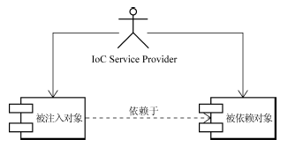
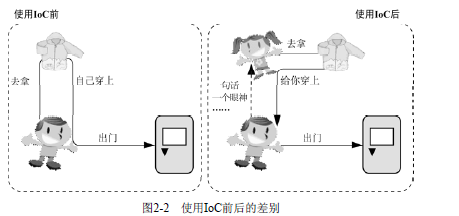
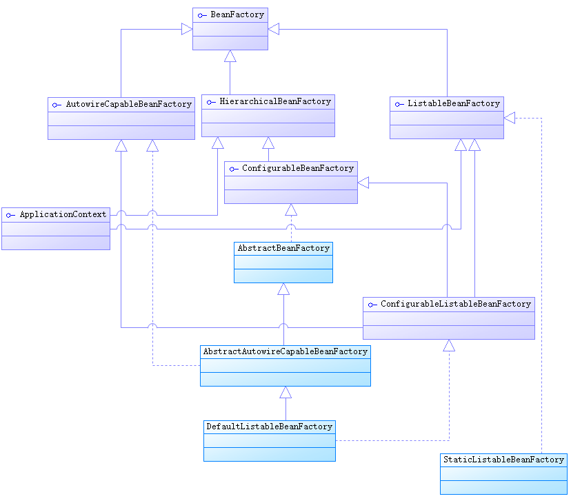
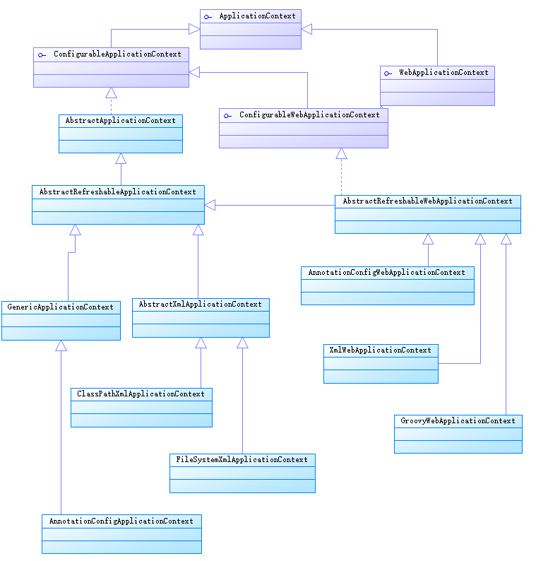

IoC是spring的核心，Spring就是一个轻量级的IoC框架。以下介绍Spring IoC的一些基础知识。

# IoC基础

IoC(Inversion of Control,控制反转)，依赖注入(Dependency Injection)是IoC的一种方式。
 IoC的理念是"让别人为你服务"，即让IoC Service Provider来提供服务，如下图:

通常情况，被注入对象会直接依赖于被依赖对象。但是使用IoC后，二者之间通过IoC Service Provider关联，所有被注入对象和依赖对象由IoC Service Provider统一管理。当被注入对象需要依赖对象时，通知IoC Service Provider将相应的被依赖对象注入到被注入对象中。

从被注入对象的角度看，与直接寻求依赖对象相比，依赖对象的取得方式发生了反转，控制从被注入对象转到了IoC Service Provider，下图形象地说明了问题：

IoC很好的体现了面向对象设计法则之一—— 好莱坞法则：“别找我们，我们找你”；即由IoC容器帮对象找相应的依赖对象并注入，而不是由对象主动去找。

所谓IoC，对于spring框架来说，就是由spring来负责控制对象的生命周期和对象间的关系。

# 依赖注入

依赖注入(Dependency Injection)是IoC的一种方式。
从注入方法上看，主要可以划分为三种类型：构造函数注入、属性注入和接口注入。

* <strong>构造方法注入(constructor injection)</strong>
被注入对象可以通过在其构造方法中声明依赖对象的参数列表，让IoC容器知道它需要依赖的对象。IoC Service Provider会检查被注入对象的构造方法，获取依赖对象列表，为其注入。
由于同一个对象不可能被构造两次，所以被注入对象的构造及其整个生命周期都是由IoC Service Provider管理。
<strong>优点:</strong>对象一构造就注入了依赖对象，即进入就绪状态
<strong>缺点:</strong>依赖对象较多时，构造方法参数列表会较长，且对于非必须的依赖处理，可能要引入多个构造方法。
类似于你一起床，就去拿衣服给你穿上。

* <strong>setter方法注入(setter injection)</strong>
被注入对象为它的依赖对象对应的属性添加setter方法，通过setter方法可以将相应的依赖对象设置到被注入对象中。
<strong>优点</strong>：setter方法注入比构造方法注入灵活；
<strong>缺点</strong>：构造完对象后，该对象并不能马上进入就绪状态，因为依赖对象还没有注入；
类似于你叫她给你穿衣，她才去拿衣服给你穿上

* <strong>接口注入(interface injection)</strong>
被注入对象若想要IoC Service Provider为其注入依赖对象，必须实现某个接口，该接口提供了一个方法用来为其注入依赖
对象(注:该方法的参数类型是依赖对象的类型)。IoC Service Provider通过该接口来为被注入对象注入依赖对象。
<strong>缺点</strong>：具有侵入性，不提倡使用
类似于你要先穿上裤子，她才拿衣服给你穿上

<strong>Spring支持构造函数注入和属性注入。</strong>

# IoC容器

IoC容器就是具有依赖注入功能的容器，IoC容器负责实例化、定位、配置应用程序中的对象及建立这些对象间的依赖。应用程序无需直接在代码中new相关的对象，应用程序由Spring容器进行组装。在Spring中BeanFactory是IoC容器的实际代表者。

IoC 容器是 Spring 框架的核心。容器将创建对象，把它们连接在一起，配置它们，并管理他们的整个生命周期从创建到销毁,这些对象被称为 Spring Beans。

org.springframework.beans 和 org.springframework.context 包是 Spring Framework 的 IoC
容器的根本。BeanFactory 接口提供了一种更先进的配置机制来管理任意类型的对象。
ApplicationContext 是 BeanFactory 的一个子接口。ApplicationContext 使得和 Spring 的
AOP 功能集成变得更简单；添加了信息资源处理（国际化中使用），事件发布；还添加了应用程序层的特殊上下文 ，如用于 web 应用程序的 WebApplicationContext。
简而言之，BeanFactory提供了配置框架和基本功能，而ApplicationContext 添加了更多企业
应用功能。ApplicationContext完整扩展了BeanFactory。

## BeanFactory

Spring BeanFactory 容器是最简单的容器，给 DI 提供了基本的支持，用 org.springframework.beans.factory.BeanFactory 接口表示。
BeanFactory 是工厂设计模式的实现，允许通过名称创建和检索对象。BeanFactory也可以管理对象之间的关系。
BeanFactory接口相关的主要的继承结构，如下:

## ApplicationContext

Application Context 是 spring 中较高级的容器。和 BeanFactory 类似，它可以加载配置文件中定义的 bean。 另外，ApplicationContext除了提供上述BeanFactory所能提供的功能之外，还提供了更完整的框架功能：
* 国际化支持 
* 资源访问
例如：Resource rs = ctx. getResource(”classpath:config.properties”)
* 事件传递：通过实现ApplicationContextAware接口

ApplicationContext的继承结构，如下：

最常用的ApplicationContext接口实现：
* <strong>FileSystemXmlApplicationContext</strong>：从文件系统或者url指定的xml配置文件加载bean，参数为配置文件名或文件名数组 
* <strong>ClassPathXmlApplicationContext</strong>：从classpath的xml配置文件加载bean，可以从jar包中读取配置文件 
* <strong>AnnotationConfigApplicationContext</strong>：基于注解来使用的，它不需要配置文件，采用 java 配置类和各种注解来配置，是比较简单的方式。
* <strong>AnnotationConfigWebApplicationContext</strong>：基于注解来使用的
* <strong>XmlWebApplicationContext</strong>：从Web系统中的XML文件载入上下文定义信息