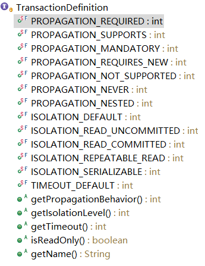

## 事务基础

事务就是一组原子性的SQL查询。事务内的语句，要么全部执行成功，要么全部执行失败。可以用START TRANSACTION语句开始一个事务，然后要么使用COMMIT提交事务将修改的数据持久保留，要么使用ROLLBACK撤销所有的修改。

### 事务特性ACID

ACID，是指在可靠数据库管理系统（DBMS）中，事务(transaction)所应该具有的四个特性。
* <strong>原子性（Atomicity）</strong>
事务是一个不可再分割的工作单位，事务中的操作要么都发生，要么都不发生。<br>
在数据库管理系统（DBMS）中，默认情况下一条SQL就是一个单独事务，事务是自动提交的。只有显式的使用start transaction开启一个事务，才能将一个代码块放在事务中执行。

   ```sql
    begin transaction
    update account set money = money - 100 where name = 'A'
    update account set money = money + 100 where name = 'B'
    if Error then
        rollback
    else
        commit
   ```
* <strong>一致性（Consistency）</strong>
数据库总是从一个一致性的状态转换到另外一个一致性的状态。
在事务开始之前和事务结束以后，数据库的完整性约束没有被破坏。即数据库事务不能破坏关系数据的完整性以及业务逻辑上的一致性。
例如：对银行转帐事务，不管事务成功还是失败，应该保证事务结束后ACCOUNT表中aaa和bbb的存款总额为2000元。
数据库层面的一致性是，在一个事务执行之前和之后，数据会符合你设置的约束（唯一约束，外键约束,Check约束等)和触发器设置。
* <strong>隔离性（Isolation）</strong>
一个事务所做的修改在最终提交以前，对其它事务是不可见的。也指多个事务并发访问时，事务之间是隔离的，一个事务不应该影响其它事务运行效果
* <strong>持久性（Durability）</strong>
一旦事务提交，事务所做的修改就永久地保存到数据库中，即使系统崩溃，修改的数据也不会丢失。

### 事务间影响

事务并发时，事务之间的相互影响有脏读，不可重复读，幻读，丢失更新这几种。

* <strong>脏读</strong>
一个事务读取了另一个事务未提交的数据，而这个数据是有可能回滚的；
e.g.
    ```text
    事务1：更新一条数据
                 ------------->事务2：读取事务1更新的记录
    事务1：调用commit进行提交
    ```
* <strong>丢失更新</strong>
两个事务同时读取同一条记录，A先修改记录，B也修改记录（B是不知道A修改过），B提交数据后B的修改结果覆盖了A的修改结果
* <strong>不可重复读</strong>
一个事务范围内两个相同的查询却返回了不同数据
这是由于查询时系统中其他事务修改的提交而引起的。
e.g.
    ```text
  事务1：查询一条记录
            -------------->事务2：更新事务1查询的记录
             -------------->事务2：调用commit进行提交
  事务1：再次查询上次的记录
    ```
* <strong>幻读</strong>
指的是在一个事务1中执行了一个当前读操作，而另外一个事务2在事务1的影响区间内insert了一条记录，这时事务1再执行一个当前读操作时，出现了幻行。
它和不可重复读的主要区别就在于事务1中一个是快照读，一个是当前读；并且事务2中一个是任何的dml操作，一个只是insert。
e.g.

    ```text
    事务1：select * from test where id<10 lock in share mode
                              -------------->事务2：插入一条记录id=4
                              -------------->事务2：调用commit进行提交
    事务1：再次执行上述语句，或执行Insert id=4记录
    ```

### 事务隔离级别

为了避免上述几种事务之间的影响，SQL中定义了4中隔离级别，每种级别都规定了一个事务中所做的修改，哪些是在事务内和事务间是可见的，哪些是不可见的。
通过设置不同的隔离级别来进行不同程度的避免事务间的影响。因为高的隔离等级意味着更多的锁，从而牺牲性能。

| 隔离级别 | 脏读 | 丢失更新 |不可重复读|幻读|
|:-----|:-----|:-----|:-----|:-----|:-----|
|未提交读|是|是|是|是|
|已提交读|否|是|是|是|
|可重复读|否|否|否|是|
|可串行读|否|否|否|否|

## Spring事务原理
Spring事务的本质其实就是数据库对事务的支持，没有数据库的事务支持，spring是无法提供事务功能的。
原始的JDBC操作数据库时，按照如下步骤来开启事务：

```java
 //1.获取数据库连接
 Connection con = DriverManager.getConnection();
 //2.开启事务
 con.setAutoCommit(true/false);
 //3.执行SQL，略
 //4.提交或回滚事务
  con.commit() //提交
 //con.rollback();//回滚
 //5.关闭连接
 con.close();
```

Spring接管事务后，由AOP实现步骤2和步骤4。在具体讲如何使用Spring事务管理前，我们先来了解一些Spring事务的基本知识。

Spring中提供了关于事务管理的接口主要有如下三个：

* <strong>PlatformTransactionManager-事务管理器</strong>，真正管理事务，包含事务提交和回滚操作；
Spring框架支持事务管理的核心是事务管理器抽象，对于不同的数据访问框架通过实现策略接口PlatformTransactionManager，从而能支持多钟数据访问框架的事务管理。spring提供了很多内置事务管理器，支持不同数据源，常见的有三大类
  * <strong>DataSourceTransactionManager</strong>：org.springframework.jdbc.datasource包下，数据源事务管理类，提供对单个javax.sql.DataSource数据源的事务管理，只要用于JDBC，Mybatis框架事务管理。
  * <strong>HibernateTransactionManager</strong>：org.springframework.orm.hibernate3包下，数据源事务管理类，提供对单个org.hibernate.SessionFactory事务支持，用于集成Hibernate框架时的事务管理；注意：该事务管理器只支持Hibernate3+版本，且Spring3.0+版本只支持Hibernate 3.2+版本。
  * <strong>JtaTransactionManager</strong>：位于org.springframework.transaction.jta包中，提供对分布式事务管理的支持，并将事务管理委托给Java EE应用服务器，或者自定义一个本地JTA事务管理器，嵌套到应用程序中。
* <strong>TransactionDefinition-事务定义信息</strong>，包含隔离级别、传播行为、是否超时、是否只读等事务基本属性；
* <strong>TransactionStatus-事务具体的运行状态<strong/>，如是否为新事务，是否有保存点，是否已完成等。

这里我们先只详细介绍事务定义TransactionDefinition接口，看一下Spring对数据库事务的抽象，如下为TransactionDefinition接口。

以下根据TransactionDefinition接口定义说明Spring事务的基本属性。

### Spring事务的隔离级别

Spring事务的隔离级别常量解释如下表。

| 常量名称|说明|
|:-----|:-----|
| ISOLATION_DEFAUL | <font color="red">默认级别，表示使用数据库默认的事务隔离级别</font>，另外四个与JDBC隔离级别对应|
| ISOLATION_READ_UNCOMMITTED |读未提交 |
| ISOLATION_READ_COMMITTED | 读已提交 |
| ISOLATION_REPEATABLE_READ | 可重复度|
| ISOLATION_SERIALIZABLE | 可串行读|

### Spring事务的传播行为

【参考】 [解读底层原理，分析Spring事务管理那些事](http://mp.weixin.qq.com/s?__biz=MzIzMDk2ODA2NQ==&mid=2247484410&idx=1&sn=72bf3f67544985cdfb0d92c698e5ea3b&chksm=e8aa1d94dfdd9482d8a77acdedab2a8b7093977a5dbfa03b172a2e6aeeb14d052f2c958bfe9b&mpshare=1&scene=1&srcid=0401FLcnRiCt02aIFfjp9E5u#rd)
spring事务的传播属性，就是定义在存在多个事务同时存在的时候，spring应该如何处理这些事务的行为。

| 常量名称|说明|
|:-----|:-----|
|PROPAGATION_REQUIRED|<font color="red">Spring事务默认传播行为</font>。支持当前事务，若当前没有事务则新建一个事务|
|PROPAGATION_SUPPORTS|支持当前事务，若当前没有事务则以非事务方式执行，确切的行为取决于实际的同步事务管理器的配置，需要慎用|
|PROPAGATION_MANDATORY|支持当前事务，若当前没有事务则抛异常|
|PROPAGATION_REQUIRES_NEW|新建事务。若当前存在事务，则将当前事务挂起，新建事务同被挂起事务没有任何关系，是两个独立的事务。|
|PROPAGATION_NOT_SUPPORTED|以非事务方式执行，若当前存在事务则将当前事务挂起，适用于JtaTransactionManager|
|PROPAGATION_NEVER|以非事务方式运行，若当前存在事务则抛异常|
|PROPAGATION_NESTED|若有事务存在，则运行在一个嵌套的事务中；若没有事务，则新建一个单独的事务。该嵌套事务有多个回滚保存点，内部事务的回滚不会对外部事务造成影响，且事务传播行为只在DataSourceTransactionManager中生效|

### 事务嵌套

讲到Spring事务的传播行为，就不得不说一下事务嵌套。例如ServceA的methodA()中调用ServiceB的methodB()。

1. 若ServiceB.methodB()的事务传播行为是PROPAGATION_REQUIRED
    * 若ServiceA.methodA()已开启事务了，则ServiceB.methodB()直接运行在ServiceA.methodA()事务中，不再开启事务；ServicA.methodA()或ServiceB.methodB()异常都会回滚事务。
    * 若ServiceA.methodA()没有事务，则ServiceB.methodB()独自开启一个事务。

2. ServiceB.methodB() 的传播行为是 PROPAGATION_REQUIRES_NEW
不论ServiceA.methodA()有没有事务，ServiceB.methodB()都会新起一个独立的事务；只是若ServcieA.methodA()有事务则该事务会先暂停，ServiceB.methodB()事务完成后才继续执行。
若ServiceB.methodB()异常，其事务会回滚；若ServiceB.methodB()的异常往外抛，ServiceA.methodA()捕获该异常，ServiceA.methodA()可以选择针对该异常是继续提交还是回滚自身的事务。

3. ServiceB.methodB() 的事务传播行为是 PROPAGATION_SUPPORTS
若ServiceA.methodA()已经开启了一个事务，则加入当前的事务；若ServiceA.methodA()没有开启事务，则自己也不开启事务。

4. ServiceB.methodB() 的事务传播行为是 PROPAGATION_NESTED
若ServiceB.methodB() rollback, 那么内部事务(即 ServiceB.methodB()的事务) 将回滚到它执行前的 SavePoint 而外部事务(即 ServiceA.methodA()的事务) 可以捕获ServiceB.methodB()的异常，根据具体情况决定自己是commit还是rollback。

## Spring事务管理

### 编程式事务管理

所谓编程式事务指的是通过编码方式实现事务，即类似于JDBC编程实现事务管理。Spring框架提供一致的事务抽象，对于JDBC还是JTA事务都是采用相同的API进行编程；而在底层，Spring 仍然将事务操作委托给底层的持久化框架来执行。

基于 TransactionDefinition、PlatformTransactionManager、TransactionStatus 编程式事务管理是 Spring 提供的最原始的方式，通常我们不会直接用。

Spring中提供了<font color="red">事务管理模板-TransactionTemplate</font>，推荐使用PlatformTransactionManager+TransactionTemplate实现事务管理。以DataSourceTransactionManager+TransactionTemplate为例。
步骤1：声明DataSourceTransactionManager，它的构造依赖DataSource

```xml
    <!-- 加载jdbc.property -->
    <bean id="propertyConfigurer" class="org.springframework.beans.factory.config.PropertyPlaceholderConfigurer">
        <property name="locations">
              <list>
                <value>classpath:jdbc.properties</value> 
              </list>
        </property>
    </bean>
    <!-- 数据源配置, 使用DBCP数据库连接池 -->
    <bean id="dataSource" class="org.apache.commons.dbcp.BasicDataSource" destroy-method="close">
        <!-- 数据库连接信息配置-->
        <property name="driverClassName" value="${jdbc.driver}"/>
        <property name="url" value="${jdbc.url}"/>
        <property name="username" value="${jdbc.username}"/>
        <property name="password" value="${jdbc.password}"/>
        <!-- 连接池配置 -->
        <property name="maxActive" value="3"/>
        <property name="defaultAutoCommit" value="false"/>
        <!-- 连接Idle一个小时后超时 -->
        <property name="timeBetweenEvictionRunsMillis" value="3600000"/>
        <property name="minEvictableIdleTimeMillis" value="3600000"/>
    </bean>
    <bean id="transactionManager" class="org.springframework.jdbc.datasource.DataSourceTransactionManager" scope="singleton">
        <property name="dataSource" ref="dataSource"/>  
    </bean>
```

步骤2：声明TransactionTemplate实例

```xml
    <!-- 声明事务模板 -->
     <bean id="transactionTemplate"
         class="org.springframework.transaction.support.TransactionTemplate">
         <property name="transactionManager">
             <ref bean="transactionManager" />
         </property>
     </bean>
```

步骤3：使用TransactionTemplate实现事务管理

```java
//jdbcTemplate,transactionTemplatez注入这里就省略了
@Test  
public void testTransactionTemplate(){  
    String insert_sql = "insert into t_test(id) values(?)";  
    String count_sql = "select count(*) from t_test";
    int i = jdbcTemplate.queryForInt(count_sql);    
    System.out.println("表中记录总数："+i);  
    //事务隔离级别设置
    transactionTemplate.setIsolationLevel(TransactionDefinition.ISOLATION_READ_COMMITTED);    
    //重写execute方法实现事务管理  
    transactionTemplate.execute(new TransactionCallbackWithoutResult() {  
        @Override  
        protected void doInTransactionWithoutResult(TransactionStatus status) {  
            jdbcTemplate.update(insert_sql, "测试");//字段id为int型，插入异常自动回滚 
        }}  
    );  
    i = jdbcTemplate.queryForInt(count_sql);    
    System.out.println("表中记录总数："+i);  
}  
```

TransactionTemplate通过调用参数类型为TransactionCallback或TransactionCallbackWithoutResult的execute方法来实现自动事务管理。

* <strong>TransactionCallback</strong>：通过实现该接口的“T doInTransaction(TransactionStatus status) ”方法来定义需要事务管理的操作代码；
*  <strong>TransactionCallbackWithoutResult </strong>：继承TransactionCallback接口，提供“void doInTransactionWithoutResult(TransactionStatus status)”便利接口用于方便那些不需要返回值的事务操作代码。


### 声明式事务管理

Spring 的声明式事务管理在底层是建立在 AOP 的基础之上的。其本质是对方法前后进行拦截，然后在目标方法开始之前创建或者加入一个事务，在执行完目标方法之后根据执行情况提交或者回滚事务。

声明式事务最大的优点就是不需要通过编程的方式管理事务，这样就不需要在业务逻辑代码中掺杂事务管理的代码，只需在配置文件中做相关的事务规则声明（或通过等价的基于标注的方式），便可以将事务规则应用到业务逻辑中。

声明式事务实现方式主要有2种，一种为通过使用Spring的&lt;tx:advice>定义事务通知与AOP相关配置实现，另为一种通过@Transactional实现事务管理实现。

<strong>方式一：&lt;tx:advice> + AOP</strong>，XML配置如下：

```xml
<!--定义DataSource,TransactionManager，同编程式事务管理，这里就省略 -->
<!--   
<tx:advice>定义事务通知，用于指定事务属性，其中“transaction-manager”属性指定事务管理器，并通过<tx:attributes>指定具体需要拦截的方法  
    <tx:method>拦截方法，其中参数有：  
    name:方法名称，将匹配的方法注入事务管理，可用通配符  
    propagation：事务传播行为，  
    isolation：事务隔离级别定义；默认为“DEFAULT”  
    timeout：事务超时时间设置，单位为秒，默认-1，表示事务超时将依赖于底层事务系统；  
    read-only：事务只读设置，默认为false，表示不是只读；  
    rollback-for：需要触发回滚的异常定义，可定义多个，以“，”分割，默认任何RuntimeException都将导致事务回滚，而任何Checked Exception将不导致事务回滚；  
    no-rollback-for：不被触发进行回滚的 Exception(s)；可定义多个，以“，”分割；  
 -->
<tx:advice id="advice" transaction-manager="transactionManager">  
    <tx:attributes>  
        <!-- 拦截save开头的方法，事务传播行为为：REQUIRED -->  
        <tx:method name="save*" propagation="REQUIRED" isolation="READ_COMMITTED" timeout="" read-only="false" no-rollback-for="" rollback-for=""/>  
        <!-- 支持,如果有就有,没有就没有 -->  
        <tx:method name="*" propagation="SUPPORTS"/>  
    </tx:attributes>  
</tx:advice>  
<!--AOP配置-->  
<aop:config>  
    <!-- 定义切入点，expression为切人点表达式，如下是指定impl包下的所有方法 -->
    <aop:pointcut expression="execution(* com.kaizhi.*.service.impl.*.*(..))" id="pointcut"/>  
    <!--advice定义 -->  
    <aop:advisor advice-ref="advice" pointcut-ref="pointcut"/>  
</aop:config>
```

<strong>方式二：@Transactional注解</strong>

(1)开启事务注解
```xml
<!--定义DataSource,TransactionManager，同编程式事务管理，这里就省略 -->      
<tx:annotation-driven transaction-manager="transactionManager"/><!--开启事务注解-->  
```

(2)使用@Transactional注解

```java
@Transactional(propagation=Propagation.REQUIRED,isolation=Isolation.READ_COMMITTED)
```

注意：

1. 如果在接口、实现类或方法上都指定了@Transactional 注解，则优先级顺序为<font color="red">方法>实现类>接口</font>；
2. <font color="red">建议只在实现类或实现类的方法上使用@Transactional，而不要在接口上使用</font>，这是因为如果使用JDK代理机制（基于接口的代理）是没问题；而使用使用CGLIB代理（继承）机制时就会遇到问题，因为其使用基于类的代理而不是接口，这是因为接口上的@Transactional注解是“不能继承的”。


